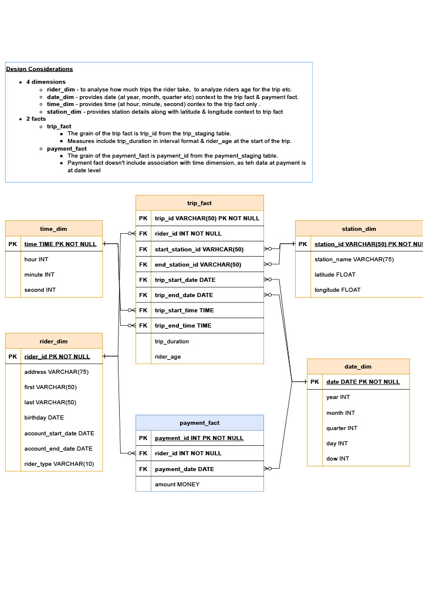
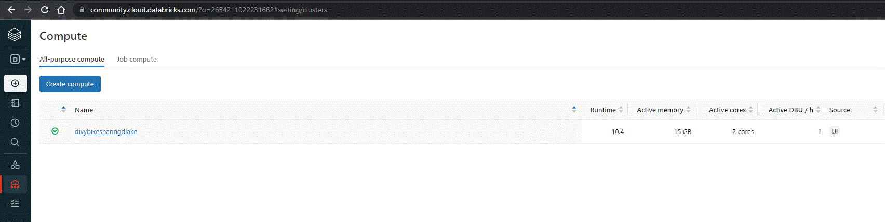
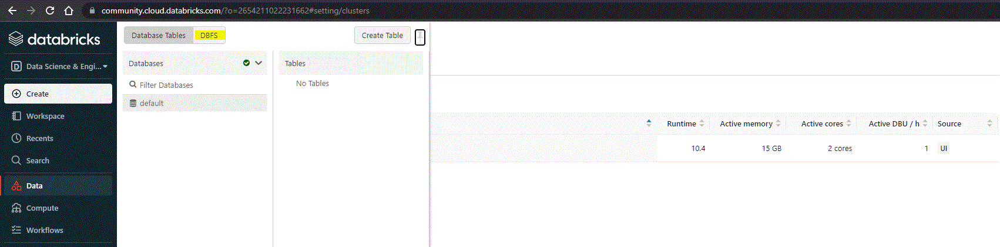
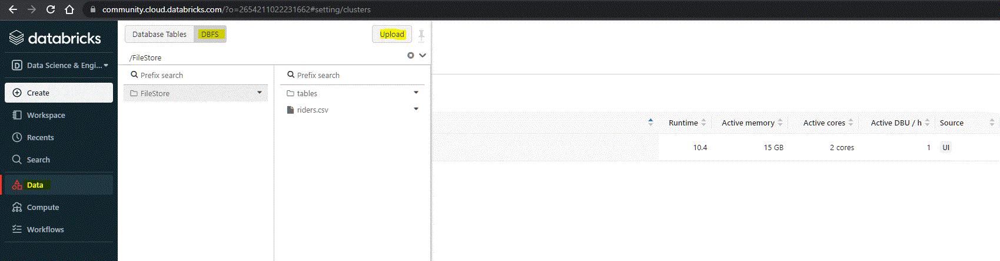
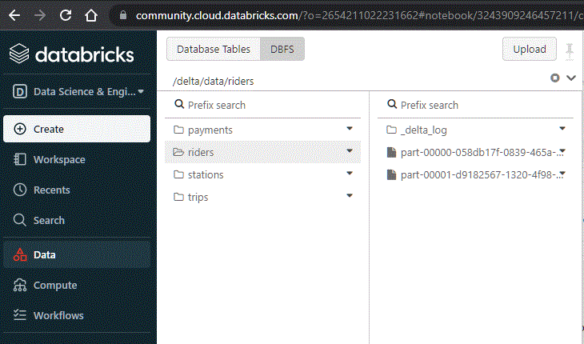
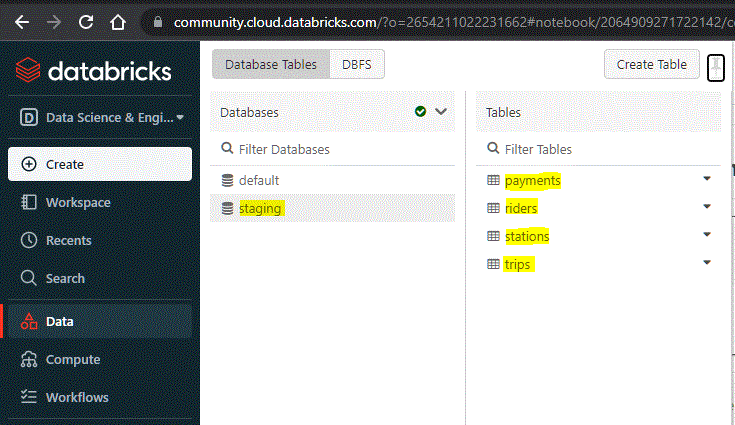

# azure-data-lakehouse-dbricks
## Data lake solution for Divvy bikeshare using Databricks

### The goal of this project is to develop a data lake solution using Azure Databricks using a lake house architecture. You will:
- Design a star schema based on the business outcomes listed below.
- Import the data into Azure Databricks using Delta Lake to create a Bronze data store.
- Create a gold data store in Delta Lake tables.
- Transform the data into the star schema for a Gold data store.

### The business outcomes you are designing for are as follows:
- Analyze how much time is spent per ride
  - Based on date and time factors such as day of week and time of day
  - Based on which station is the starting and / or ending station
  - Based on age of the rider at time of the ride
  - Based on whether the rider is a member or a casual rider
- Analyze how much money is spent
  - Per month, quarter, year
  - Per member, based on the age of the rider at account start
- EXTRA CREDIT - Analyze how much money is spent per member
  - Based on how many rides the rider averages per month
  - Based on how many minutes the rider spends on a bike per month

## Divy Bikeshare Dimensional Model (Star Schema)

## Project Setup
- **For this project i'm using databricks community edition**
  ### Infrastructure Setup
  - Create a databricks cluster. To create a cluster using the user interface, either 
    - Click the Create Cluster button in the Compute section
    - Click New > Cluster in your workspace's side navigation. Refer to screenshot below
  
  - To Import data (.csv files) into databricks you need to enable DBFS File Browser.
    - Go to the admin console.
    - Click the Workspace Settings tab.
    - In the Advanced section, click the DBFS File Browser toggle.
    - Click Confirm.
    - Refresh the workspace. Refer to screenshot below
  

  ### Data Lakehouse Setup
  - Import the data (.csv files) into Azure Databricks using Delta Lake to create a Bronze data store
    - Select **Upload data** to access the **data upload UI** and load CSV files into Delta Lake tables. Refer to screenshot below
  
  - Upload .csv files into DBFS and load the data into delta file locations. Refer to [extract-step.ipynb](C:\Users\cnaik1\code-udacity\azure-data-lakehouse-dbricks\extract-step.ipynb). 
    - Verify if extract step is successfull by navigating to Data > DBFS > delta > payments | riders | stations | trips. Each of these folders should contain delta files. Screenshot for reference below
  
  - Create a staging scheme with staging tables and insert data into these staging tables using delta file location. Refer to [load-step.ipynb](C:\Users\cnaik1\code-udacity\azure-data-lakehouse-dbricks\load-step.ipynb)
    - Verify if load step is succesfull by navigating to Data > Database > staging > riders | payments |  stations | trips (tables) with data should exist. Screenshot for reference below
  
  - Create Date, Rider, Station and Time dimensions. 
    - For Date dimension refer to [date-dim.ipynb](C:\Users\cnaik1\code-udacity\azure-data-lakehouse-dbricks\dimensions\date_dim.ipynb)
    - For Rider dimension refer to [rider-dim.ipynb](C:\Users\cnaik1\code-udacity\azure-data-lakehouse-dbricks\dimensions\rider_dim.ipynb)
    - For Station dimension refer to [station-dim.ipynb](C:\Users\cnaik1\code-udacity\azure-data-lakehouse-dbricks\dimensions\station_dim.ipynb)
    - For Time dimension refer to [time-dim.ipynb](C:\Users\cnaik1\code-udacity\azure-data-lakehouse-dbricks\dimensions\time_dim.ipynb)
  - Create Trips and Payments facts
    - For payments fact refer to [payments-fact.ipynb](C:\Users\cnaik1\code-udacity\azure-data-lakehouse-dbricks\facts\payments_fact.ipynb)
    - For Trips fact refer to [trips-fact.ipynb](C:\Users\cnaik1\code-udacity\azure-data-lakehouse-dbricks\facts\trips_fact.ipynb)
    
